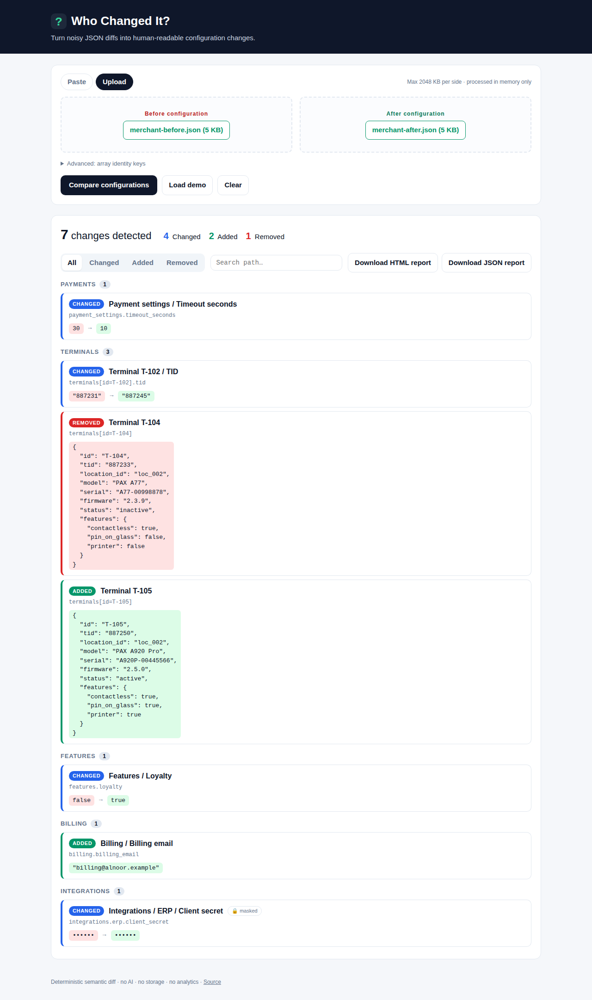
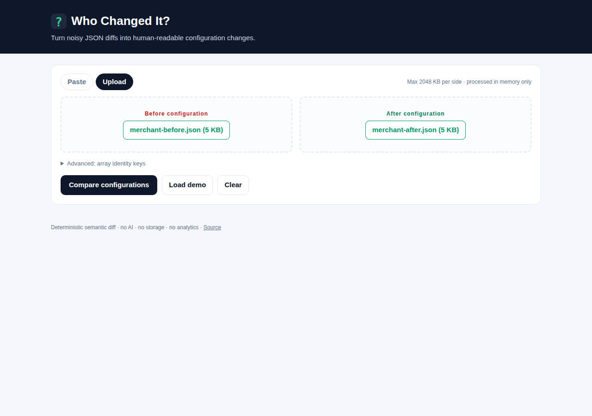
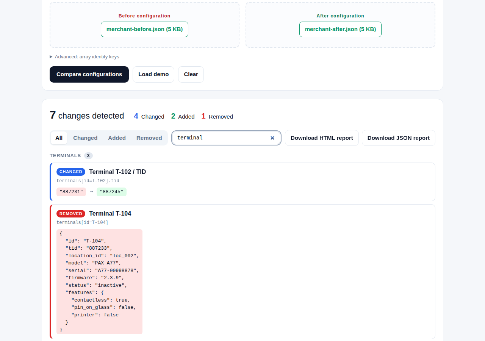
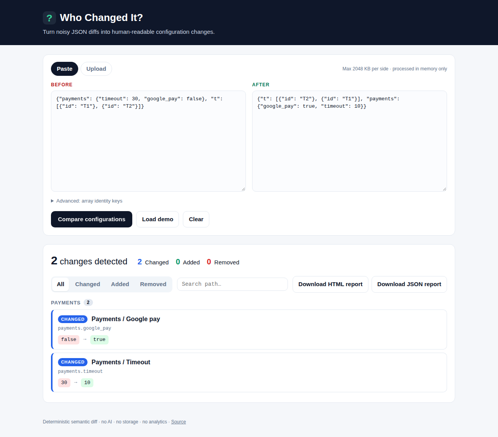
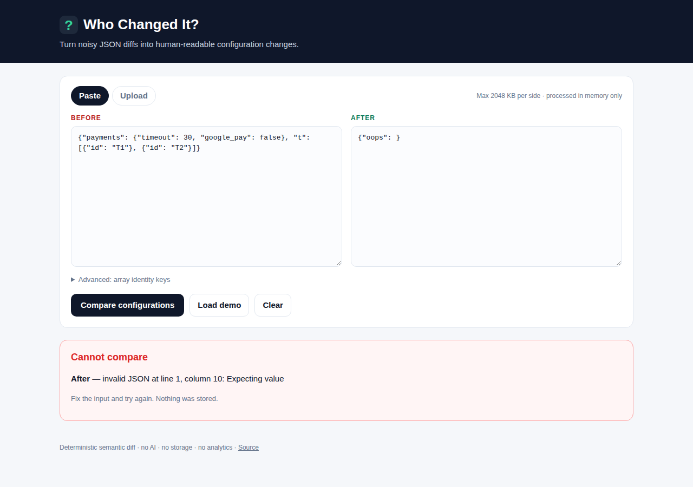
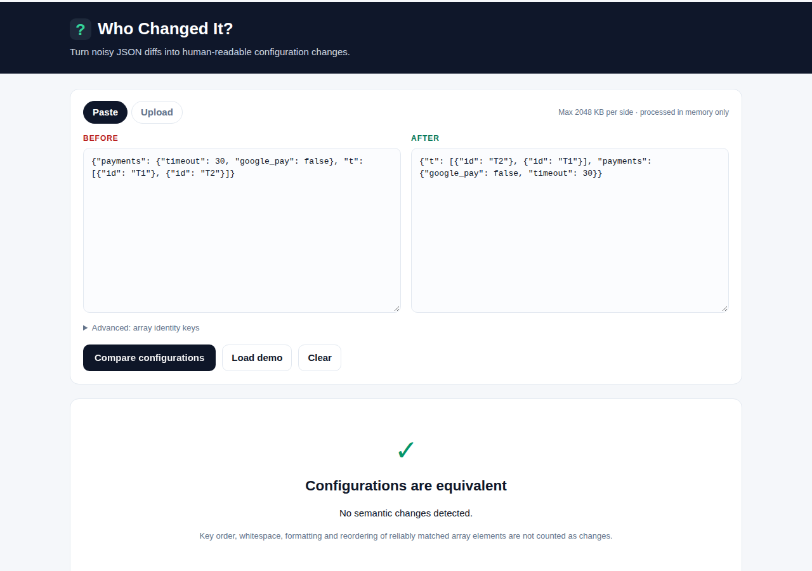

# Who Changed It?

**Turn noisy JSON diffs into human-readable configuration changes.**

```text
before.json + after.json
        ↓
   Who Changed It?
        ↓
7 meaningful configuration changes
```

[](https://github.com/VsevaTech/who-changed-it/actions/workflows/ci.yml)


Self-hosted, deterministic, no AI, no database. Paste or upload two JSON configurations and get a
report a support engineer, product manager or analyst can actually read.



## Problem

Production settings for a merchant, company, terminal fleet or feature set usually live in one big
JSON document. Then one day:

```text
Yesterday everything worked.
Today payment behavior changed.
What exactly changed in configuration?
```

A plain text diff is a poor tool for that question:

- reordered object keys show up as changes;
- a reordered array looks like everything was rewritten;
- the business meaning of `payment_settings.timeout_seconds: 30 → 10` is buried in braces;
- support, product and analysts should not have to read raw diffs at all.

**Who Changed It?** answers *what actually changed* — and nothing else.

```text
7 changes detected

Payment settings / Timeout seconds      30 → 10
Features / Loyalty                      false → true
Terminal T-102 / TID                    "887231" → "887245"
Terminal T-104                          Removed
Terminal T-105                          Added
Billing / Billing email                 Added: "billing@alnoor.example"
Integrations / ERP / Client secret      •••••• → ••••••   (masked)
```

## Features

- **Semantic diff** — `ADDED`, `REMOVED`, `CHANGED` with raw JSON path *and* a human-readable path
  (`terminals[id=T-102].tid` → `Terminal T-102 / TID`).
- **Array identity matching** — arrays of objects are paired by a reliable identity key
  (`id`, `uuid`, `code`, `key`, `name`, `tid`, `terminal_id`, …, configurable), so reordering is not
  a change and a modified element is reported as *that element*, not as "everything moved".
- **Explicit fallback** — when no reliable key exists the array is compared by position and the
  report says `Array matched by position`. No guessing.
- **Noise reduction** — key order, whitespace, formatting and safe reorders are ignored;
  `"30"` vs `30`, `true` vs `1`, `null` vs `""` are *not* considered equal.
- **Decimal-safe numbers** — floats are parsed as `Decimal`, never `float`, so `12.50` stays `12.50`.
- **Change groups** — Company, Payments, Terminals, Features, Billing, Locations, or the name of the
  JSON section for anything else.
- **Filters and search** — All / Changed / Added / Removed, plus free-text path search.
- **Sensitive value masking** — passwords, secrets, tokens and keys are detected by key name and
  masked *before* rendering; the fact of a change is shown, the value never is.
- **Exports** — standalone HTML report and machine-readable JSON report (both masked).
- **Two input modes** — upload two files or paste two documents.
- **Validation** — clear parse errors with line/column, size limit per input, depth limit, `null` is
  a valid document.

## Screenshots

| Upload | Filtered by `terminal` |
| --- | --- |
|  |  |

| Paste with reordered array (2 real changes, 0 noise) | Invalid JSON | Equivalent |
| --- | --- | --- |
|  |  |  |

## Quick Start

```bash
git clone https://github.com/VsevaTech/who-changed-it.git
cd who-changed-it
python -m venv .venv && source .venv/bin/activate
pip install -e ".[dev]"
uvicorn app.main:app --reload
```

Open <http://127.0.0.1:8000>, click **Load demo**, then **Compare configurations**.

## Docker

```bash
docker compose up --build
# → http://localhost:8000
```

Environment variables:

| Variable | Default | Meaning |
| --- | --- | --- |
| `WCI_PORT` | `8000` | Host port to publish |
| `WCI_MAX_INPUT_BYTES` | `2097152` | Max size of each input document (2 MiB) |
| `WCI_BASE_IMAGE` | `python:3.12-slim` | Base image (override if Docker Hub is not reachable) |

The container runs as an unprivileged user with a read-only root filesystem and
without an access log.

## Example

`examples/merchant-before.json` and `examples/merchant-after.json` describe a realistic merchant
(company, payment settings, billing, features, locations, terminals, integrations). Between the two
files, objects and arrays have been shuffled *and* exactly seven real changes were made:

| # | Change | Type |
| --- | --- | --- |
| 1 | `payment_settings.timeout_seconds` 30 → 10 | changed |
| 2 | `features.loyalty` false → true | changed |
| 3 | `terminals[id=T-102].tid` "887231" → "887245" | changed |
| 4 | `terminals[id=T-104]` | removed |
| 5 | `terminals[id=T-105]` | added |
| 6 | `billing.billing_email` | added |
| 7 | `integrations.erp.client_secret` (masked) | changed |

Everything else — reordered terminals and locations, reordered `card_schemes`, shuffled keys,
`1.00` vs `1.0` — produces **zero** noise.

CLI-style use through the JSON API:

```bash
curl -F before_file=@examples/merchant-before.json \
     -F after_file=@examples/merchant-after.json \
     http://localhost:8000/api/compare
```

## Semantic array matching

For an array of objects the matcher looks for the first candidate identity key that is:

1. present in **every** element on both sides,
2. a scalar (string / number / boolean),
3. **unique** within the "before" array and within the "after" array.

Default candidates, in priority order:

```text
id, uuid, code, key, name, tid, terminal_id, company_id, location_id
```

You can override them in the UI (**Advanced: array identity keys**) or via the `identity_keys` form
field (`sku, code`). If a key qualifies, elements are paired by it — so this is *no change*:

```json
[{"id": "T1", "tid": "1001"}, {"id": "T2", "tid": "1002"}]
[{"id": "T2", "tid": "1002"}, {"id": "T1", "tid": "1001"}]
```

and this is exactly one change, `terminals[id=T2].tid: "1002" → "9999"`:

```json
[{"id": "T2", "tid": "9999"}, {"id": "T1", "tid": "1001"}]
```

Arrays of scalars with unique values are matched by value (so `["visa", "mc"]` vs `["mc", "visa"]` is
no change). Everything else — no common key, duplicate identities, mixed or nested arrays — falls back
to positional comparison, and every affected change is labelled **Array matched by position**.

Identity values are type-aware: `{"id": "1"}` and `{"id": 1}` are different elements.

## Sensitive values

Keys are checked along the whole path, case-insensitively, by token (`camelCase`, `snake_case` and
`kebab-case` are all split): `password`, `passwd`, `pwd`, `secret`, `token`, `authorization`,
`apikey`, `credential(s)`, `cvv`, `cvc`, plus compounds such as `api_key`, `private_key`,
`client_secret`, `access_token`, `refresh_token`, `pin_code`.

Only the fact of a change is reported:

```text
client_secret
•••••• → ••••••
Changed
```

Masking is applied inside the diff engine, so raw secrets never reach the HTML, the exports, the
in-page JSON used for export, or any log. A whole object that is added or removed is masked
field-by-field (`{"provider": "zoho", "client_secret": "••••••"}`). Detection is by key name only —
a secret stored under an innocuous key will be shown; see Limitations.

## Privacy

The application is self-hosted and stateless:

- both documents are parsed in memory and discarded when the request ends;
- nothing is written to a database, file or cache;
- request bodies are never logged (the Docker image runs uvicorn with `--no-access-log`, and the
  app does not log payloads on errors);
- there is no analytics, telemetry, or external call of any kind;
- the exported reports are generated from the already-masked result the browser sends back, not
  from the original documents.

## No AI, fully deterministic

The diff is plain code. No OpenAI, Anthropic, Gemini or any other external API is used. The same
pair of inputs always produces the same report, byte for byte (changes are sorted by path).

## Architecture

```text
app/
├── main.py                  FastAPI routes (thin: parse form → service → template)
├── models/diff.py           Pydantic models: Change, Summary, DiffReport
├── services/
│   ├── parser.py            JSON parsing, Decimal numbers, size/depth limits, friendly errors
│   ├── array_matcher.py     identity / value / positional matching of array elements
│   ├── diff_engine.py       recursive semantic diff, type-aware equality, deterministic order
│   ├── sensitive.py         sensitive key detection and masking
│   ├── paths.py             raw paths, humanized display paths, change groups
│   ├── report.py            JSON + standalone HTML rendering (Decimal-safe serializer)
│   └── compare.py           use-case entry point used by the routes
├── templates/               Jinja2: index, results fragment, error, export report
└── static/                  app.css, app.js (vanilla, ~120 lines: mode switch, filters, search)

tests/                       pytest suite (78 tests)
examples/                    merchant-before.json / merchant-after.json
scripts/demo.py              Playwright end-to-end demo (upload, filters, exports, paste, errors)
```

Flow: `before.json + after.json → parse → normalize → semantic diff → human-readable changes →
export`. Business logic lives entirely in `app/services`; routes only translate HTTP.

## Tests

```bash
pytest -q          # 78 tests
ruff check .       # lint
ruff format --check .
```

Covered: identical documents, changed primitive, added/removed field, nested change, `null → value`,
`value → null`, boolean change, `"30"` vs `30`, key reorder (no change), array reorder with `id`
(no change), array element changed/added/removed, arrays without identity (positional + note),
nested arrays, duplicate identities, type-aware identities, scalar arrays, sensitive field
changed/added/removed (masked, including exports), invalid JSON, empty object/array, size and depth
limits, HTTP upload/paste/export flows, and the two critical scenarios from the spec.

CI (`.github/workflows/ci.yml`) runs `ruff check`, `ruff format --check`, `pytest`, then builds the
Docker image and smoke-tests the running container against the demo files.

End-to-end demo (what the screenshots above show) against a running instance:

```bash
pip install playwright && playwright install chromium
docker compose up -d --build
python scripts/demo.py --base http://localhost:8000 --out docs
```

It uploads the demo files, checks the 7 changes, the masked secret, the filters and both exports,
then the paste flow, an invalid-JSON error and the "equivalent" state, and exits non-zero if
anything is off. The `Demo & screenshots` workflow runs the same script in GitHub Actions and
commits refreshed screenshots to `docs/`.

## Limitations

- **Not an audit or compliance system.** It shows configuration differences; it does not know *who*
  made a change or *when*, does not sign or store anything, and must not be used as evidence.
- Sensitive-value detection is **key-name based**. A secret under a key such as `value` or `data`
  is not masked. Review reports before sharing.
- Identity keys are chosen from a candidate list; a document whose natural key is not in the list
  (e.g. `sku`) needs the key added in **Advanced** or the array is compared by position.
- Moves between arrays (an element deleted in one array and inserted in another) are reported as
  a removal plus an addition.
- Numeric equality is exact decimal equality: `1.00 == 1`, but `1.0000000001 != 1`. String vs number
  is always a change.
- Display names use simple English heuristics (`terminals` → `Terminal`, `snake_case` → words).
- Single-node, in-memory processing: the default 2 MiB per-document limit is deliberate.

## License

MIT — see [LICENSE](LICENSE).
